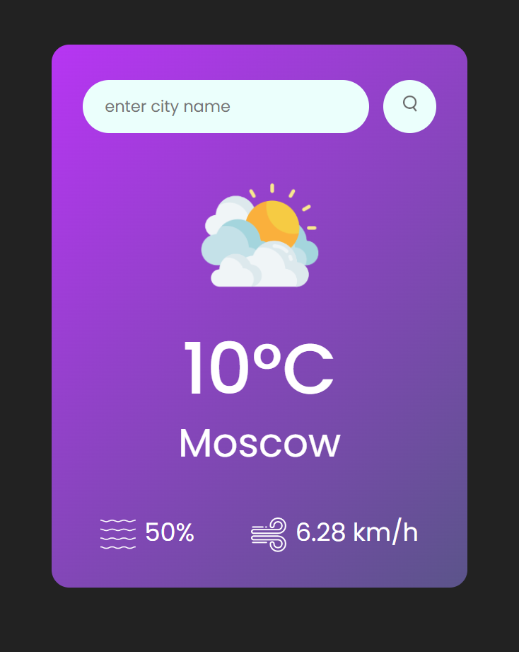

# Weather web site
## Enjoy it deployed
https://rotvein.github.io/weather-web-site/
## Intro

## Description
A simple weather web site that fetches data from the openweathermap API and shows the processed data on the page. 
## How to use
1. Open the `index.html` 
2. Pass any city in the input 
3. Press enter or click the button
